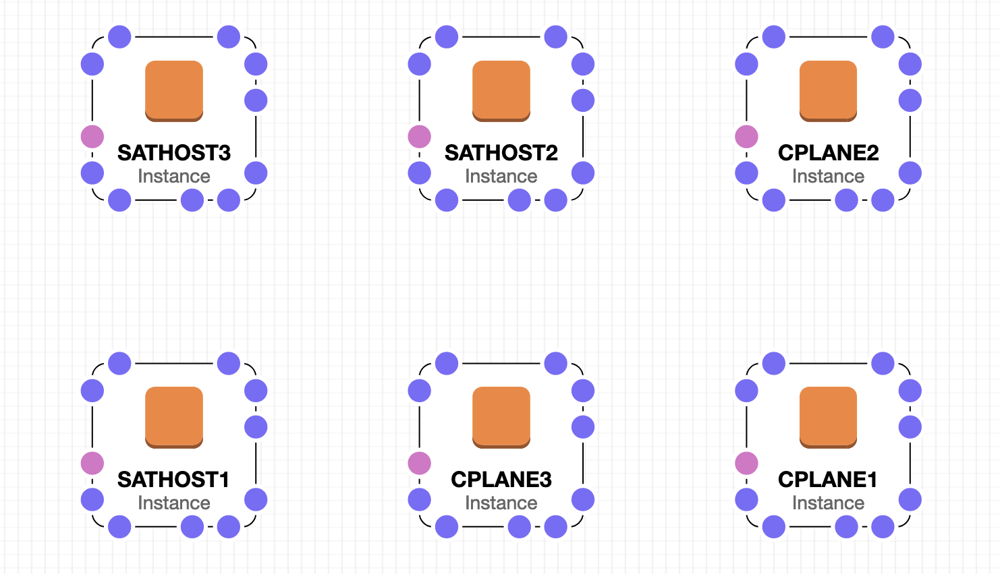

# CloudFormation for creating hosts in AWS for ibm-cloud-satellite
This CloudFormation only creates the hosts needed for IBM Cloud Satellite. It assumes that the VPC and networking have already been created.

1. Either file can be uploaded to use as a template for CloudFormation. One is formatted as yaml and the other is json.
2. The CloudFormation creates 6 VMs 3 for the control plane for IBM Cloud Satellite and 3 to be used as worker nodes. The control plane nodes are hard wired as **m5d.xlarge** instances. The size for the worker nodes is selectable.

 
3. Once uploaded the stack can be created. The stack is provided a name and the following parameters can be configured. In most cases the parameters are selectable.
| Parameter | Description |
|---|---|
| Infrastructure Name | A short, unique cluster ID used to name and tag nodes for the kubelet cloud provider. |
| Security Groups | Select the Security Groups to be used by the satellite nodes |
| Satellite Subnet 1 | The subnets, to launch the satellite nodes into. |
| Satellite Subnet 2 | The subnets, to launch the satellite nodes into. |
| Satellite Subnet 3 | The subnets, to launch the satellite nodes into. |
| Instance Type | The type of instance to use for the worker nodes |
| Key pair | The name of an existing EC2 KeyPair to enable SSH access to the instance. |
| Make Public | Specify whether to configure public IP addresses for the nodes |
